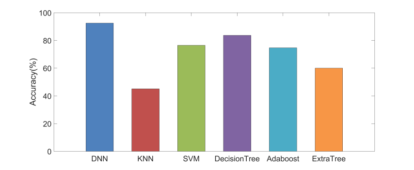

# 电动汽车价格预测

题目来源于:[全国首届研究生工业与金融大数据建模](http://math.shufe.edu.cn/f8/43/c1991a129091/page.htm) 初赛C题

某品牌电动汽车给出了不同规格的电动车属性与价格数据（见 train.xlsx），

另有一批未 知价格的电动车属性数据（见 test.xlsx），请通过挖掘属性与价格之间的关系给出这批未知价格电动车的价格预测。

train.xlsx 部分数据

| id   | feat1 | feat2 | feat3 | feat4 | feat5 | feat6 | feat7 | feat8 | feat9 | feat10 | feat11 | feat12 | feat13 | feat14 | feat15 | feat16 | feat17 | feat18 | feat19 | feat20 | price |
| ---- | ----- | ----- | ----- | ----- | ----- | ----- | ----- | ----- | ----- | ------ | ------ | ------ | ------ | ------ | ------ | ------ | ------ | ------ | ------ | ------ | ----- |
| 1    | 1512  | 0     | 0.6   | 1     | 1     | 1     | 54    | 0.4   | 134   | 3      | 2      | 220    | 1838   | 3366   | 7      | 3      | 11     | 1      | 0      | 1      | 3     |
| 2    | 614   | 0     | 2.9   | 1     | 3     | 1     | 24    | 0.2   | 94    | 4      | 7      | 409    | 603    | 1930   | 13     | 12     | 4      | 1      | 0      | 1      | 1     |
| 3    | 553   | 0     | 0.5   | 1     | 2     | 1     | 23    | 0.5   | 119   | 3      | 3      | 993    | 1517   | 2981   | 7      | 3      | 14     | 1      | 0      | 0      | 2     |
| 4    | 718   | 0     | 0.7   | 1     | 0     | 1     | 21    | 0.8   | 88    | 1      | 7      | 518    | 830    | 1754   | 17     | 11     | 9      | 1      | 0      | 1      | 1     |

对应标签说明

| 字段   | 字段说明                              |
| ------ | ------------------------------------- |
| id     | ID                                    |
| feat1  | 电池可以一次性存储的总能量，单位为mAh |
| feat2  | 是否有蓝牙                            |
| feat3  | 微处理器执行指令的速度                |
| feat4  | 有双SIM卡支持与否                     |
| feat5  | 前置摄像头百万像素                    |
| feat6  | 是否支持4G                            |
| feat7  | 内存（以GB为单位）                    |
| feat8  | 移动深度（cm）                        |
| feat9  | 重量                                  |
| feat10 | 处理器核心数                          |
| feat11 | 主要相机百万像素                      |
| feat12 | 像素分辨率高度                        |
| feat13 | 像素分辨率宽度                        |
| feat14 | 以兆字节为单位的随机存取存储器        |
| feat15 | 屏幕高度（以cm为单位）                |
| feat16 | 屏幕宽度（以cm为单位）                |
| feat17 | 单个电池充电时间最长的时间            |
| feat18 | 是否有3G                              |
| feat19 | 是否有触摸屏                          |
| feat20 | 是否有wifi                            |
| price  | 价格分档，取值为0,1,2,3               |

分析: 每一条数据有20个特征,1个价格标签(共4类), 可以当作分类问题,

本文主要用DNN来解决,并与KNN、SVM、决策树等分类算法进行对比。

准确率如下图所示:

